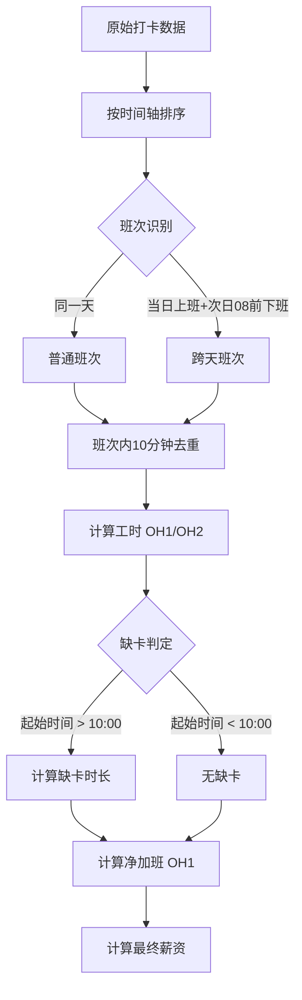

### 考勤与薪资计算需求规格说明书

#### 1. 全局配置参数

为了确保系统的灵活性、可维护性以及算法的透明度，所有业务规则中的时间阈值、费率及常量均提取为全局变量。这些变量将作为系统运行的基准参数。

| 参数名称           | 变量名                  | 默认值    | 说明                                               |
| ------------------ | ----------------------- | --------- | -------------------------------------------------- |
| **标准上班时刻**   | `STD_START_TIME`        | `"08:00"` | 每日标准工时开始时间                               |
| **标准下班时刻**   | `STD_END_TIME`          | `"18:00"` | 每日标准工时结束时间                               |
| **标准工时时长**   | `STD_HOURS_PER_DAY`     | `10`      | 每日应出勤小时数                                   |
| **打卡去重阈值**   | `DEDUPLICATE_THRESHOLD` | `10`      | 连续打卡间隔（分钟），小于此值视为重复             |
| **加班一时段起点** | `OT1_START_TIME`        | `"18:00"` | OH1 开始时间                                       |
| **加班一时段终点** | `OT1_END_TIME`          | `"22:00"` | OH1 结束时间                                       |
| **加班二时段起点** | `OT2_START_TIME`        | `"22:00"` | OH2 开始时间                                       |
| **加班二时段终点** | `OT2_END_TIME`          | `"08:00"` | OH2 结束时间（次日）                               |
| **缺卡判定阈值**   | `LATE_CHECK_THRESHOLD`  | `"10:00"` | 早于此时限的打卡视为正常或加班，晚于此时限视为缺卡 |
| **OH1 薪资费率**   | `RATE_OH1`              | `20`      | 加班时段一单价（元/小时）                          |
| **OH2 薪资费率**   | `RATE_OH2`              | `30`      | 加班时段二单价（元/小时）                          |

#### 2. 数据处理核心流程

数据处理的顺序至关重要，必须遵循“先关联，后清洗”的原则，以确保跨天班次的完整性。

- **步骤一：数据聚合与排序**
  - 将Excel中该员工所有日期的打卡记录提取，合并为一个按时间轴排序的连续数组。
- **步骤二：班次识别与跨天关联**
  - **逻辑**：遍历时间轴，识别“上班”与“下班”的配对。
  - **跨天判定**：若当前仅有“上班打卡”，且下一次打卡发生在次日 `08:00` 之前，则将这两次打卡标记为同一个**“跨天班次”**。
  - **目的**：防止按自然日切割导致跨天加班数据断裂。
- **步骤三：班次内去重（10分钟规则）**
  - **作用域**：仅在步骤二确定的“班次”范围内执行。
  - **规则**：
    - 在班次的“上班时段”内，若存在多次打卡且间隔 `≤ DEDUPLICATE_THRESHOLD`，取**最早**时间。
    - 在班次的“下班时段”内，若存在多次打卡且间隔 `≤ DEDUPLICATE_THRESHOLD`，取**最晚**时间。
- **步骤四：工时计算与薪资核算**
  - 基于清洗后的班次起止时间，切割计算各时段工时并应用薪资公式。

#### 3. 班次识别与跨天逻辑

此模块负责将离散的打卡点连接成有意义的工作时段。

- **连续工作时段定义**
  - **普通班次**：上班打卡与下班打卡发生在同一天（例如 08:00 - 18:00）。
  - **跨天班次**：仅有上班打卡（例如 20:00），且下一次打卡发生在次日 `08:00` 之前。
- **跨天合并规则**
  - 若识别为跨天班次，将**当日**与**次日**的打卡合并为一个逻辑班次处理。
  - **基准时间**：该班次的“真实开始时间”为第一天的打卡时间，“真实结束时间”为第二天的打卡时间。
  - **次日标记**：次日的打卡记录被标记为 `isContinuation`（延续），不再独立计算缺卡逻辑，仅用于计算结束时间。

#### 4. 工时计算逻辑

基于识别出的“连续工作时段”进行时间段切割。

- **时段划分**
  - **正常工时**：`STD_START_TIME` 至 `STD_END_TIME` 之间的实际在岗时间。
  - **加班时段一**：`OT1_START_TIME` 至 `OT1_END_TIME` 之间的实际在岗时间。
  - **加班时段二**：`OT2_START_TIME` 至 `OT2_END_TIME` 之间的实际在岗时间。
- **跨天计算示例**
  - 场景：1号 20:00 上班 -> 2号 02:00 下班。
  - 计算：
    - 1号 20:00 - 22:00 计入 `加班时段一`。
    - 2号 00:00 - 02:00 计入 `加班时段二`。
    - 2号 02:00 的打卡作为结束时间，不触发缺卡判定。

#### 5. 缺卡判定与薪资抵扣

此逻辑仅针对**连续工作时段的起始点**进行判定，解决跨天加班被误扣费的问题。

- **判定逻辑**
  - **检查对象**：该班次的“真实开始时间”。
  - **豁免条件**：若“真实开始时间”在 `LATE_CHECK_THRESHOLD` 之前（例如早上 07:50 打卡），或属于下午/晚间时段（如 13:00 或 20:00），则**不视为缺卡**。
  - **扣款条件**：仅当“真实开始时间”在 `08:00` 至 `LATE_CHECK_THRESHOLD` 之间（例如 10:00 打卡），才计算缺卡时长。
- **抵扣公式**
  - `缺卡正常工时` = `真实开始时间` - `STD_START_TIME`。
  - `净加班时段一` = `原始加班时段一` - `缺卡正常工时`。
  - 注意：`净加班时段一` 最小值为 0。

#### 6. 变量定义与输出规范

最终输出给前端表格的数据结构，以及用于核验的原始数据字段。

| 中文名称         | 变量名               | 说明                                                         |
| ---------------- | -------------------- | ------------------------------------------------------------ |
| **员工姓名**     | `employeeName`       | 员工姓名                                                     |
| **考勤组**       | `attendanceGroup`    | 员工所属的考勤组                                             |
| **部门**         | `department`         | 员工所属部门                                                 |
| **实际总工时**   | `totalActualHours`   | 正常工时 + OH1 + OH2                                         |
| **正常工时**     | `normalHours`        | 08:00-18:00 期间的工时                                       |
| **加班时段一**   | `overtimeHoursOH1`   | 18:00-22:00 期间的原始工时                                   |
| **加班时段二**   | `overtimeHoursOH2`   | 22:00-次日08:00 期间的工时                                   |
| **缺卡正常工时** | `missingNormalHours` | 因晚打卡导致的缺卡时长                                       |
| **净加班时段一** | `netOvertimeOH1`     | 扣除缺卡后的有效加班时长                                     |
| **加班总薪资**   | `overtimeWage`       | `(netOvertimeOH1 * RATE_OH1) + (overtimeHoursOH2 * RATE_OH2)` |
| **原始打卡记录** | `rawPunches`         | 用于前端核验的当日所有打卡点数组                             |
| **算法处理标签** | `logicTags`          | 用于前端展示的算法说明（如“10分钟去重”）                     |

#### 7. 逻辑流程图

