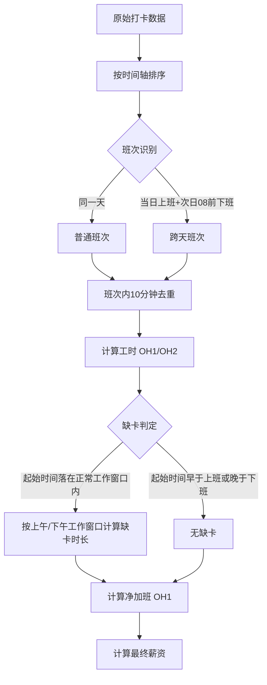

### 考勤与薪资计算需求规格说明书

#### 1. 全局配置参数

为了确保系统的灵活性、可维护性以及算法的透明度，所有业务规则中的时间阈值、费率及常量均提取为全局变量。这些变量将作为系统运行的基准参数。

| 参数名称           | 变量名                  | 默认值    | 说明                                               |
| ------------------ | ----------------------- | --------- | -------------------------------------------------- |
| **标准上班时刻**   | `STD_START_TIME`        | `"08:00"` | 每日标准工时开始时间                               |
| **标准下班时刻**   | `STD_END_TIME`          | `"18:00"` | 每日标准工时结束时间                               |
| **午休开始时刻**   | `BREAK_START_TIME`      | `"11:30"` | 缺卡计算时的午休起点，该时间段不计入缺卡           |
| **午休结束时刻**   | `BREAK_END_TIME`        | `"12:30"` | 缺卡计算时的午休终点，该时间段不计入缺卡           |
| **标准工时时长**   | `STD_HOURS_PER_DAY`     | `10`      | 每日应出勤小时数                                   |
| **打卡去重阈值**   | `DEDUPLICATE_THRESHOLD` | `10`      | 连续打卡间隔（分钟），小于此值视为重复             |
| **加班一时段起点** | `OT1_START_TIME`        | `"18:00"` | OH1 开始时间                                       |
| **加班一时段终点** | `OT1_END_TIME`          | `"22:00"` | OH1 结束时间                                       |
| **加班二时段起点** | `OT2_START_TIME`        | `"22:00"` | OH2 开始时间                                       |
| **OH1 薪资费率**   | `RATE_OH1`              | `20`      | 加班时段一单价（元/小时）                          |
| **OH2 薪资费率**   | `RATE_OH2`              | `30`      | 加班时段二单价（元/小时）                          |

补充说明：`OH2` 不再单独配置“结束时间”。该时段默认从 `OT2_START_TIME` 开始，持续到该逻辑班次的真实结束打卡为止；若为跨天班次，则结束点为次日第一次有效打卡。

#### 2. 数据处理核心流程

数据处理的顺序至关重要，必须遵循“先关联，后清洗”的原则，以确保跨天班次的完整性。

- **步骤一：数据聚合与排序**
  - 将Excel中该员工所有日期的打卡记录提取，合并为一个按时间轴排序的连续数组。
- **步骤二：班次识别与跨天关联**
  - **逻辑**：遍历时间轴，识别“上班”与“下班”的配对。
- **跨天判定**：若当前仅有“上班打卡”，且下一次打卡发生在次日 `08:00` 之前，则将这两次打卡标记为同一个**“跨天班次”**。
  - **实现约束**：只有当“当前自然日”在剔除已被前一日占用的延续打卡后，**仅剩 1 个候选打卡点**时，才允许触发跨天判定；若当天已存在成对的上下班打卡，则次日早班打卡必须保留为次日自己的上班记录，不能并入前一日。
  - **目的**：防止按自然日切割导致跨天加班数据断裂。
- **步骤三：班次内去重（10分钟规则）**
  - **作用域**：仅在步骤二确定的“班次”范围内执行。
  - **规则**：
    - 实现上按时间轴对班次内打卡做**连续聚类**：相邻两次打卡间隔 `≤ DEDUPLICATE_THRESHOLD` 视为同一簇。
    - 第一簇取**最早**时间作为有效上班时间。
    - 最后一簇取**最晚**时间作为有效下班时间。
    - 该聚类规则适用于普通班次和深夜跨天班次，不能简单按“中午12点前后”切分，否则会误伤 `23:00 -> 次日06:00` 这类夜班场景。
- **步骤四：工时计算与薪资核算**
  - 基于清洗后的班次起止时间，切割计算各时段工时并应用薪资公式。

#### 3. 班次识别与跨天逻辑

此模块负责将离散的打卡点连接成有意义的工作时段。

- **连续工作时段定义**
  - **普通班次**：上班打卡与下班打卡发生在同一天（例如 08:00 - 18:00）。
  - **跨天班次**：仅有上班打卡（例如 20:00），且下一次打卡发生在次日 `08:00` 之前。
- **跨天合并规则**
  - 若识别为跨天班次，将**当日**与**次日**的打卡合并为一个逻辑班次处理。
  - **基准时间**：该班次的“真实开始时间”为第一天的打卡时间，“真实结束时间”为第二天的打卡时间。
  - **次日标记**：次日的打卡记录被标记为 `isContinuation`（延续），不再独立计算缺卡逻辑，仅用于计算结束时间。
  - **前端展示**：若开始日的下班时间落在次日，详情表格可显示为 `次日 HH:mm`；但“个人每日工时明细图”必须将跨天班次拆成两段展示：
    - 开始日只展示到 `24:00`。
    - 次日从 `00:00` 开始展示延续部分。
    - 拆分后的时间段仍必须绘制在各自所属自然日的同一条时间轴中心线上，不能出现纵向错位或漂移到其他日期行。
    - 单日图表横轴最大值固定为 `24:00`，不得出现 `26:41` 这类超出当日坐标范围的刻度。

#### 4. 工时计算逻辑

基于识别出的“连续工作时段”进行时间段切割。

- **时段划分**
  - **正常工时**：`STD_START_TIME` 至 `STD_END_TIME`（08:00-18:00）之间的实际在岗时间。
  - **加班时段一（OH1）**：`OT1_START_TIME` 至 `OT1_END_TIME`（18:00-22:00）之间的实际在岗时间。
  - **加班时段二（OH2）**：`OT2_START_TIME`（22:00）之后到次日第一次打卡时间的实际在岗时间。

- **非跨天班次计算**
  - 场景：当天 08:00 上班 -> 当天 20:00 下班。
  - 计算：
    - 08:00 - 18:00 计入 `正常工时`（10小时）。
    - 18:00 - 20:00 计入 `加班时段一`（2小时）。
  
  - 场景：当天 08:00 上班 -> 当天 23:00 下班。
  - 计算：
    - 08:00 - 18:00 计入 `正常工时`（10小时）。
    - 18:00 - 22:00 计入 `加班时段一`（4小时）。
    - 22:00 - 23:00 计入 `加班时段二`（1小时）。

- **跨天班次计算**
  - 场景：1号 20:00 上班 -> 2号 02:00 下班。
  - 计算：
    - 1号 20:00 - 22:00 计入 `加班时段一`（2小时）。
    - 1号 22:00 - 24:00 + 2号 00:00 - 02:00 计入 `加班时段二`（4小时）。
    - 2号 02:00 的打卡作为结束时间，不触发缺卡判定。
  
- **特殊场景：深夜开始的跨天班次**
  - 场景：1号 23:00 上班 -> 2号 06:00 下班。
  - 计算：
    - 无正常工时（未在08:00-18:00时段）。
    - 无加班时段一（未在18:00-22:00时段）。
    - 1号 23:00 - 24:00 + 2号 00:00 - 06:00 计入 `加班时段二`（7小时）。

- **加班时长取整规则**
  - `OH1` 与 `OH2` 的原始分钟数都按 **30 分钟为一个计量单位向下取整**。
  - 只有满 30 分钟才计入 0.5 小时加班。
  - 示例：
    - `40` 分钟加班，记为 `0.5` 小时。
    - `1小时29分钟` 加班，记为 `1.0` 小时。
    - `1小时30分钟` 加班，记为 `1.5` 小时。

#### 5. 缺卡判定与薪资抵扣

此逻辑仅针对**连续工作时段的起始点**进行判定，且缺卡分钟数只在正常工作窗口内累计，午休不计入缺卡。

- **判定逻辑**
  - **检查对象**：该班次的“真实开始时间”。
  - **工作窗口**：
    - 上午：`STD_START_TIME` 至 `BREAK_START_TIME`
    - 下午：`BREAK_END_TIME` 至 `STD_END_TIME`
  - **午休豁免**：`BREAK_START_TIME` 至 `BREAK_END_TIME` 为休息时间，不计入缺卡。
  - **扣款条件**：若“真实开始时间”落在 `STD_START_TIME` 与 `STD_END_TIME` 之间，则缺卡分钟数等于“开始前尚未覆盖的工作窗口分钟数”之和。
  - **跨天适用**：即使该班次最终跨天，只要开始时间发生在正常工作窗口内，仍需先计算当天缺卡，再计算后续 OH1/OH2。
- **抵扣公式**
  - `缺卡正常工时` = `开始前缺失的上午工作时段` + `开始前缺失的下午工作时段`，并按 **30 分钟为一个计量单位向上取整**。
  - `净加班时段一` = `原始加班时段一` - `缺卡正常工时`。
  - 注意：`净加班时段一` 最小值为 0。
  - 示例：
    - `40` 分钟缺卡，记为 `1.0` 小时。
    - `1小时1分钟` 缺卡，记为 `1.5` 小时。
    - 若 `12:59` 才开始上班，则缺卡为 `08:00-11:30` 与 `12:30-12:59` 两段，`11:30-12:30` 午休不计入缺卡。

#### 6. 变量定义与输出规范

最终输出给前端表格的数据结构，以及用于核验的原始数据字段。

| 中文名称         | 变量名               | 说明                                                         |
| ---------------- | -------------------- | ------------------------------------------------------------ |
| **员工姓名**     | `employeeName`       | 员工姓名                                                     |
| **考勤组**       | `attendanceGroup`    | 员工所属的考勤组                                             |
| **部门**         | `department`         | 员工所属部门                                                 |
| **实际总工时**   | `totalActualHours`   | 正常工时 + OH1 + OH2                                         |
| **正常工时**     | `normalHours`        | 08:00-18:00 期间的工时                                       |
| **加班时段一**   | `overtimeHoursOH1`   | 18:00-22:00 期间的原始工时                                   |
| **加班时段二**   | `overtimeHoursOH2`   | 22:00之后到次日第一次打卡时间的工时                          |
| **缺卡正常工时** | `missingNormalHours` | 因晚打卡导致的缺卡时长                                       |
| **净加班时段一** | `netOvertimeOH1`     | 扣除缺卡后的有效加班时长                                     |
| **加班总薪资**   | `overtimeWage`       | `(netOvertimeOH1 * RATE_OH1) + (overtimeHoursOH2 * RATE_OH2)` |
| **原始打卡记录** | `rawPunches`         | 用于前端核验的当日所有打卡点数组                             |
| **算法处理标签** | `logicTags`          | 用于前端展示的算法说明（如“10分钟去重”）                     |

补充字段（前端内部使用）：

| 中文名称         | 变量名            | 说明                                                                 |
| ---------------- | ----------------- | -------------------------------------------------------------------- |
| **报表月份**     | `reportMonth`     | 从导入报表头提取，用于详情页日期展示                                 |
| **处理后班次**   | `processedShifts` | 统一算法输出的逻辑班次数组，供总表图表与个人图表复用                 |
| **按日明细记录** | `dailyRecords`    | 以自然日组织的详情数据；若为跨天班次的次日记录，需带 `isContinuation` |

#### 7. 逻辑流程图

